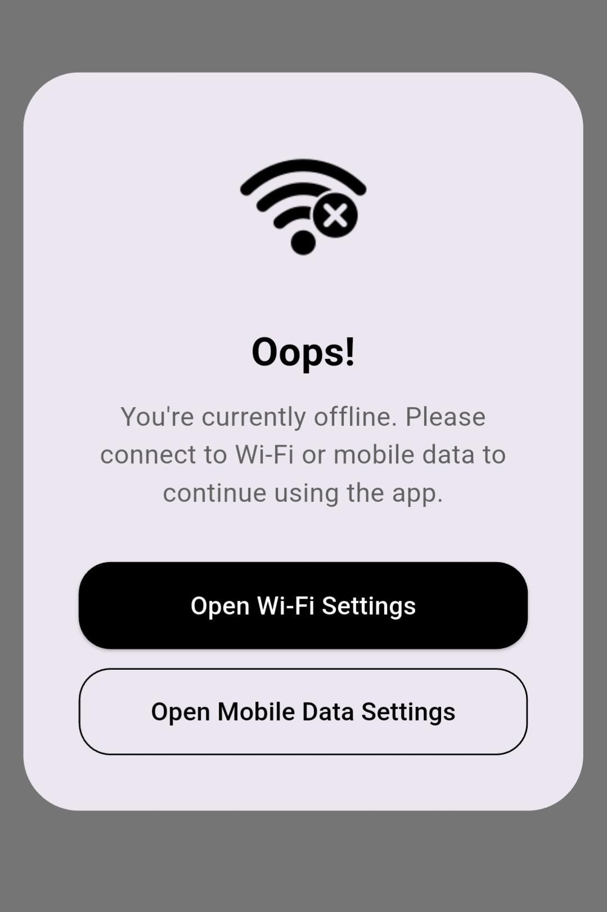
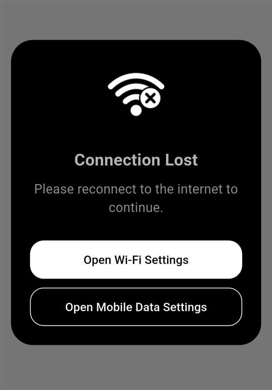

# 🛑 Network Status Dialog

A lightweight Flutter package to automatically detect internet loss (including airplane mode) and show a customizable, non-dismissible dialog — ensuring users never interact with the app while offline.

## Features

-  Auto-detects no internet or airplane mode
-  Persistent dialog until connectivity is restored
-  Fully customizable: title, description, colors
-  Open Wi-Fi / Mobile Data settings directly from the dialog
-  Easy plug & play integration

---

## 🔍 Preview

Here's how the dialog looks:




---

##  Getting Started

### 1. Add to `pubspec.yaml`

```yaml
dependencies:
  network_status_dialog: 0.0.6
```

### 2. Import and Use
```dart
import 'package:flutter/material.dart';
import 'package:network_status_dialog/network_status_dialog.dart';

void main() {
  runApp(const MyApp());
}

// Create a navigator key to allow the dialog to be shown anywhere in the app
final GlobalKey<NavigatorState> navigatorKey = GlobalKey<NavigatorState>();

/// Main App Widget
class MyApp extends StatelessWidget {
  const MyApp({super.key});

  @override
  Widget build(BuildContext context) {
    return MaterialApp(
      navigatorKey: navigatorKey, // Required for dialog navigation
      debugShowCheckedModeBanner: false,
      home: NetworkStatusListener(
        navigatorKey: navigatorKey, // Pass the navigator key here
        config: NetworkDialogConfig(
          dialogBackgroundColor: Colors.black,
          titleColor: Colors.white70,
          descriptionColor: Colors.white54,
          buttonTxtColor: Colors.white,
          title: "Oops!",
          description: "You're offline. Please check your internet connection.",
          primaryColor: Colors.red,
        ),
        child: const HomeScreen(), // Your main screen
      ),
    );
  }
}

/// Example Home Screen
class HomeScreen extends StatelessWidget {
  const HomeScreen({super.key});

  @override
  Widget build(BuildContext context) {
    return Scaffold(
      appBar: AppBar(title: const Text("Network Dialog Example")),
      body: const Center(
        child: Text("You're online."),
      ),
    );
  }
}

```


